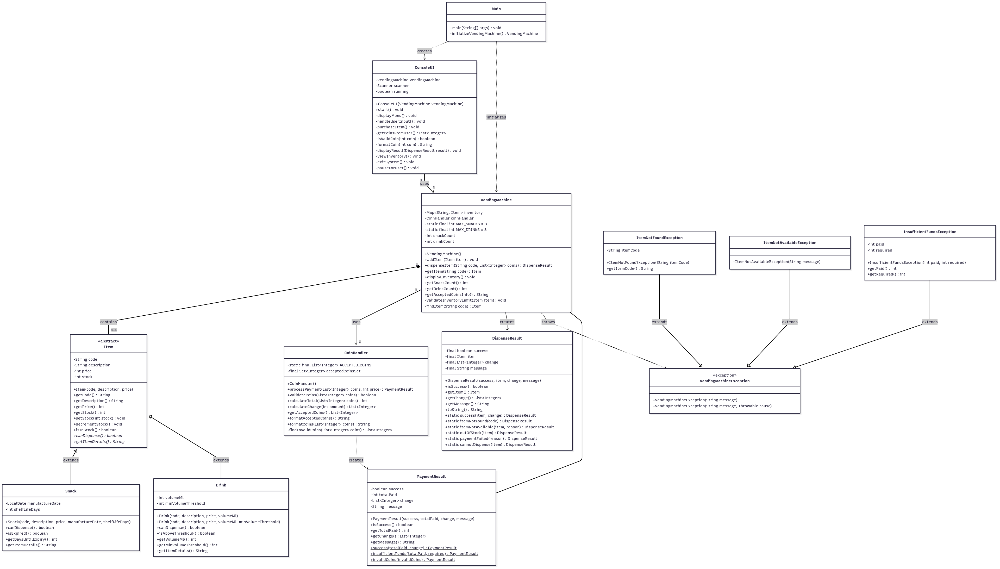
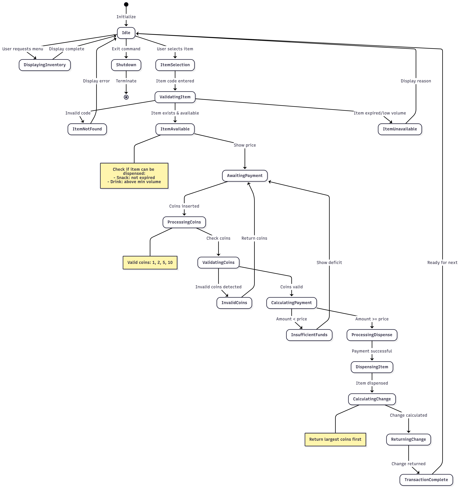
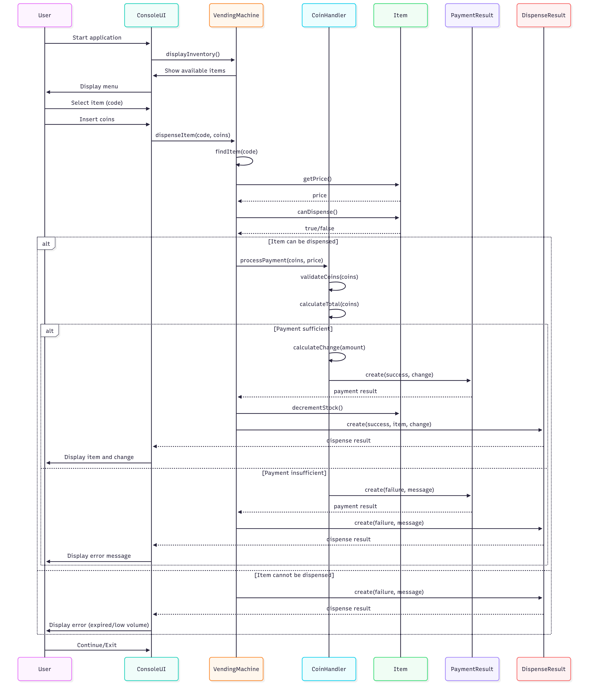

# Vending Machine System

A Java-based vending machine simulation with comprehensive payment processing, inventory management, and user interface capabilities.

## Overview

This project implements a complete vending machine system that handles:
- Inventory management for snacks and drinks
- Coin-based payment processing with change calculation
- Item availability validation (stock, expiry dates, volume thresholds)
- Interactive console-based user interface
- Comprehensive error handling and user feedback

## Features

### Core Functionality
- **Item Management**: Support for up to 3 different snacks and 3 different drinks
- **Payment Processing**: Accepts coins in denominations of $1, $2, $5, and $10
- **Smart Validation**: Automatic checking of stock levels, expiry dates, and drink volume thresholds
- **Change Calculation**: Optimal change dispensing using largest denomination coins first
- **Enhanced Payment Flow**: Users can add more coins when payment is insufficient

### Business Rules
- Maximum 3 different snack types and 3 different drink types
- Snacks expire based on manufacture date and shelf life
- Drinks below 50ml volume threshold cannot be dispensed
- Exact change or overpayment with change return supported

## Technical Architecture

### Core Classes
- `VendingMachine`: Main service orchestrating all operations
- `CoinHandler`: Payment processing and validation logic
- `Item`: Abstract base class for vending machine items
- `Snack`: Snack items with expiry date management
- `Drink`: Beverage items with volume threshold validation
- `ConsoleUI`: Interactive command-line interface
- `DispenseResult`: Result container for dispensing operations

### Design Patterns
- **Template Method**: Abstract `Item` class with concrete implementations
- **Strategy Pattern**: Different validation rules for snacks vs drinks
- **Factory Method**: Item creation and management
- **State Machine**: Payment flow with retry and cancellation states

### Design Decisions & Trade-offs

**Payment Flow Enhancement**: Implemented stateful payment process allowing users to add more coins when insufficient, improving UX over traditional "restart transaction" approach. Trade-off: slightly more complex state management for significantly better user experience.

**Greedy Change Algorithm**: Uses largest denomination first for optimal change calculation. Assumption: coin supply is unlimited. In production, would need inventory-aware change calculation.

**Validation Strategy**: Chose fail-fast validation (coins → stock → availability) to provide immediate feedback. Alternative: collect all errors, but immediate feedback improves UX for console interface.

**Memory vs Performance**: Used in-memory collections for simplicity. For production scale, would implement persistent storage with caching strategy.

### Assumptions & Constraints
- Unlimited coin supply for change-making
- Single-threaded operation (no concurrent users)
- Console-based interface sufficient for demonstration
- Business rule: exactly 3 snacks and 3 drinks maximum
- Coin denominations fixed at $1, $2, $5, $10

### Extensibility Considerations
- Abstract `Item` class allows easy addition of new product types
- `DispenseResult` pattern supports complex dispensing logic
- Validation logic separated for easy modification of business rules
- UI abstracted from core logic for alternative interfaces (GUI, web, etc.)

## Getting Started

### Prerequisites
- Java 11 or higher
- Maven 3.6+

### Building the Project
```bash
mvn clean compile
```

### Running the Application
```bash
mvn exec:java -Dexec.mainClass="com.vendingmachine.VendingMachineApp"
```

### Running Tests
```bash
# Run all tests
mvn test

# Run tests with coverage
mvn test jacoco:report

# Run specific test class
mvn test -Dtest=VendingMachineTest
```

## Usage

### Starting the Application
1. Run the main application
2. Choose from the menu options:
   - `1` - Purchase an item
   - `2` - View available items
   - `3` - Exit

### Making a Purchase
1. Select "Purchase an item"
2. Enter the item code (e.g., S1, D1)
3. Insert coins by entering denominations
4. Type "done" to complete payment
5. If insufficient funds, choose to add more coins or cancel

### Sample Items
The system comes pre-loaded with:
- **Snacks**: Chips ($2), Candy ($1), Cookies ($3)
- **Drinks**: Water ($1), Cola ($2), Juice ($3)

## Testing

The project includes comprehensive test coverage with 83 tests across:

### Test Categories
- **Unit Tests**: Individual component testing
- **Integration Tests**: Component interaction testing
- **Edge Case Tests**: Boundary conditions and error scenarios
- **UI Tests**: User interface flow validation

### Coverage Areas
- Payment processing and validation
- Inventory management and limits
- Item availability rules
- User interface interactions
- Error handling and recovery

### Key Test Scenarios
- Exact payment and overpayment with change
- Insufficient funds with retry mechanism
- Invalid coins and transaction cancellation
- Item expiry and volume threshold validation
- Maximum inventory limits enforcement
- Edge cases (large coin amounts, boundary dates)

## Project Structure

```
src/
├── main/java/com/vendingmachine/
│   ├── VendingMachineApp.java          # Main application entry point
│   ├── exception/
│   │   └── VendingMachineException.java # Custom exception handling
│   ├── model/
│   │   ├── Item.java                   # Abstract base class
│   │   ├── Snack.java                  # Snack implementation
│   │   ├── Drink.java                  # Drink implementation
│   │   ├── DispenseResult.java         # Operation result container
│   │   └── PaymentResult.java          # Payment result container
│   ├── service/
│   │   ├── VendingMachine.java         # Main business logic
│   │   └── CoinHandler.java            # Payment processing
│   └── ui/
│       └── ConsoleUI.java              # User interface
├── test/java/com/vendingmachine/       # Comprehensive test suite
├── docs/
│   └── class-diagram.md                # Technical documentation
└── assets/                             # Diagram images and visual documentation
    ├── vending-machine-class-d.png     # System class structure
    ├── vending-machine-seq-d.png       # Sequence diagram
    └── vending-machine-state-d.png     # Payment flow states
```

## System Architecture

### Class Diagram


### State Diagram


### Sequence Diagram


## Documentation

- [Technical Documentation](docs/class-diagram.md) - Detailed UML diagrams and system architecture

## Contributing

1. Follow existing code style and patterns
2. Add tests for new functionality
3. Update documentation for significant changes
4. Ensure all tests pass before submitting

## License

This project is part of a technical assessment and is intended for evaluation purposes.
